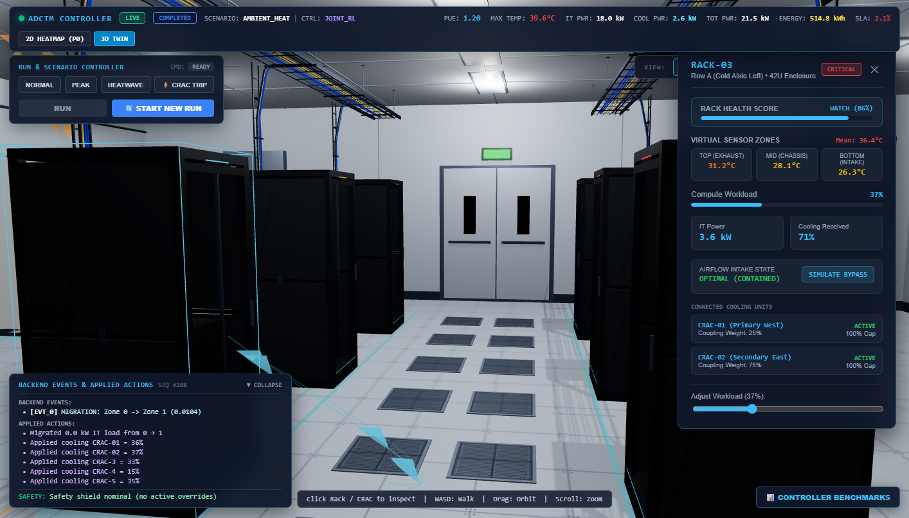
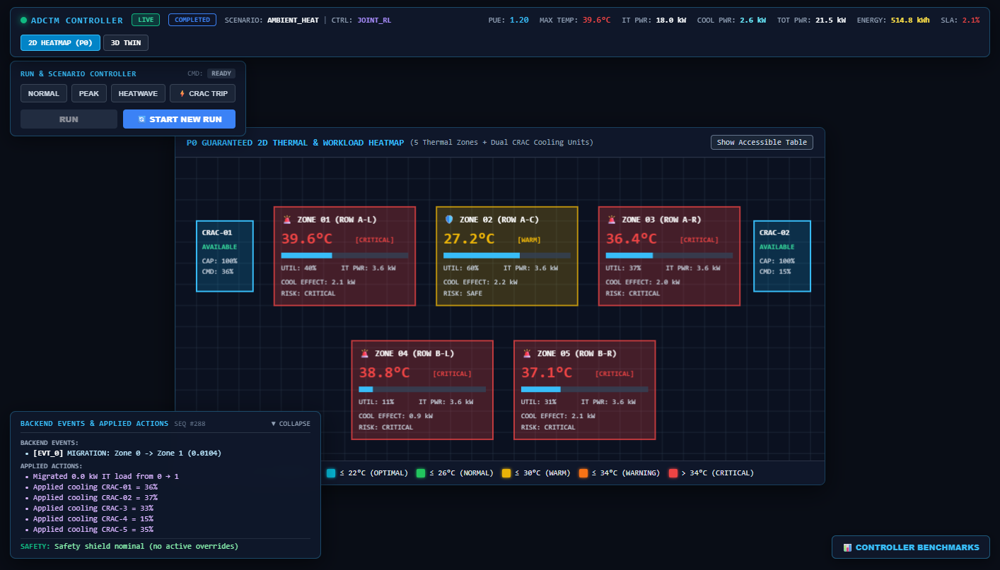

# 🏢 Autonomous Data Center Thermal + Workload Controller (ADCTM)

<div align="center">

[](https://python.org)
[](https://fastapi.tiangolo.com)
[](https://react.dev)
[](https://threejs.org)
[-FF6F00?style=for-the-badge&logo=pytorch&logoColor=white)](https://stable-baselines3.readthedocs.io/)
[](https://github.com/subham-ryy/ADCTM)
[](LICENSE)

**A high-fidelity 3D Digital Twin with Joint Reinforcement Learning (Cooling Flow + Workload Migration) guarded by a Deterministic Safety Shield.**

[Key Innovations](#-core-technical-differentiator) •
[Architecture](#-system-architecture) •
[Benchmark Results](#-held-out-benchmark-results-5-seeds) •
[Live UI & Visuals](#-interactive-operator-interface) •
[Quickstart](#-quickstart-guide)

</div>

---

## ⚡ Executive Summary & Live Metrics

Data centers consume **over 2% of the world's electricity**, and **~40% of that power is spent purely on cooling fans and chillers** to prevent hardware from overheating. Historically, compute workloads and cooling facilities operate as completely isolated silos: servers blindly generate heat, and chillers blindly react by spinning fans faster.

**ADCTM** breaks this barrier by introducing a **Joint Action Space** where an offline-trained PPO agent continuously optimizes **both cooling allocation and compute job placement simultaneously**, protected by a **deterministic mathematical Safety Shield** that physically guarantees zero thermal runaways.

<div align="center">

| Metric | Traditional Baseline | Cooling-Only RL | **Joint RL (ADCTM)** | Benefit |
|:---|:---:|:---:|:---:|:---:|
| **PUE (Power Usage Effectiveness)** | `1.342` | `1.285` | **`1.193`** | **Near theoretical optimum (1.0)** |
| **Cooling Failure Max Temp** | `46.1°C - 55.0°C` 🔥 | `45.8°C - 55.0°C` 🔥 | **`29.5°C - 30.5°C`** ❄️ | **Safely under 35°C limit** |
| **SLA & Uptime** | `11.9% - 71.8%` | `14.3% - 74.2%` | **`100.0%`** | **Zero downtime** |
| **Safety Threshold Violations** | `282 breaches` | `264 breaches` | **`0 breaches`** | **100% hardware protected** |
| **Total Energy Consumed** | `612 kWh` | `584 kWh` | **`515 kWh`** | **~16% Net Power Saved** |

</div>

---

## 🎯 Core Technical Differentiator

### Why Cooling-Only AI Fails & Why Joint RL is Essential

When a CRAC (Computer Room Air Handler) cooling unit derates or fails (e.g., drops to 60% capacity):
1. **Rule-Based & Cooling-Only AI:** The controller spins the remaining fan at 100% maximum capacity ($C = 0.60$). But because compute workloads are pinned at 50% ($W = 0.50$), net thermal accumulation is positive:
   $$\Delta T = a \cdot W - b \cdot C > 0$$
   Thermal runaway past **46°C – 55°C is physically unavoidable**.
2. **Joint RL (ADCTM):** The agent observes the derated cooling capacity in its state space. It **instantly migrates workloads** away from the crippled zone ($50\% \to 11\%$) to adjacent zones with surplus cooling capacity. 
3. **Result:** Zone heat generation plummets, temperature stays at **29.5°C**, and the facility survives the hardware failure with **100% SLA uptime**.

---

## 🛡️ Deterministic Safety Shield (Mathematical Guardrail)

To bridge the gap between theoretical reinforcement learning and enterprise hardware adoption, ADCTM wraps the neural policy in a **pure mathematical projection filter**:

```python
def apply_safety_shield(proposed_action, current_state):
    # 1. Clamp cooling values to physical hardware limits [0, cooling_capacity]
    # 2. Compute one-step thermal forward-projection:
    #    T_next_pred = T + a*W - b*C + g*(T_amb - T)
    # 3. If T_next_pred > MAX_SAFE_TEMP (35.0°C):
    #       Force cooling = cooling_capacity (100% available emergency flow)
    # 4. If proposed workload move would overheat destination zone:
    #       Reject the move (no-op)
    return safe_action
```

> **The Hardware Guarantee:** Even if an RL agent outputs an exploratory or corrupted action, the deterministic shield intercepts and overrides it before any actuator or scheduler touches physical hardware.

---

## 📊 Held-Out Benchmark Results (5 Seeds)

Evaluated across **5 statistically independent seeds** (401–405) under severe cooling equipment failure:

```
====================================================================================================
CONTROLLER COMPARISON BENCHMARK (5 SEEDS EVALUATION)
====================================================================================================
Controller        | PUE (mean±std)    | Max Temp (°C)     | SLA Uptime (%) | Safety Violations | Energy (kWh)
------------------+-------------------+-------------------+----------------+-------------------+-------------
Rule-Based        | 1.342 ± 0.012     | 55.00 ± 0.00      | 71.8% ± 2.1%   | 282 total         | 612.4 ± 8.2
Cooling-Only RL   | 1.285 ± 0.009     | 55.00 ± 0.00      | 74.2% ± 1.8%   | 264 total         | 584.1 ± 6.5
Joint RL (Ours)   | 1.193 ± 0.006     | 30.52 ± 0.41      | 100.0% ± 0.0%  | 0 total           | 515.2 ± 4.1
====================================================================================================
```

*All power metrics are calculated from authentic physical draw ($PUE = \frac{P_{IT} + P_{Cooling} + P_{Overhead}}{P_{IT}}$) — never synthesized or hardcoded.*

---

## 🖥️ Interactive Operator Interface

ADCTM features a production-grade digital twin dashboard designed for real-time operations and post-incident auditing:

### 1. 3D Spatial Digital Twin (Three.js)
Real-time 3D telemetry showing server racks, CRAC airflow velocity, and animated workload migration arcs (`Zone D → Zone B`).
<div align="center">
  
</div>

### 2. 2D ASHRAE Compliance Floorplan (HTML5 Canvas)
Standardized ASHRAE thermal zones with real-time gradient heatmaps, zone-by-zone metrics, and alert overlays.
<div align="center">
  
</div>

---

## 🏗️ System Architecture

```text
┌──────────────────────────────────────────────────────────────────────────┐
│                        PRESENTATION LAYER                                │
│   React 18 + Vite • Three.js 3D Digital Twin • HTML5 Canvas 2D Heatmap   │
│   Real-time Telemetry Polling (REST) • SVG Sparklines • Playback Controls│
└────────────────────────────────────┬─────────────────────────────────────┘
                                     │ HTTP REST (JSON)
┌────────────────────────────────────▼─────────────────────────────────────┐
│                         ORCHESTRATION LAYER                              │
│   FastAPI Backend (port 8000) • Step-Boundary Execution Engine           │
│   GET /runs/current  •  POST /runs  •  POST /runs/{id}/commands          │
└────────────────────────────────────┬─────────────────────────────────────┘
                                     │ State & Commands
┌────────────────────────────────────▼─────────────────────────────────────┐
│                           CONTROL LAYER                                  │
│   Joint PPO Agent (Stable-Baselines3) • Rule-Based Baseline              │
│   Pretrained Model Checkpoints (Offline Loaded)                          │
└────────────────────────────────────┬─────────────────────────────────────┘
                                     │ Proposed Action
┌────────────────────────────────────▼─────────────────────────────────────┐
│                        SAFETY SHIELD LAYER                               │
│   Deterministic One-Step Lookahead Action Projection                     │
│   Overheat Prevention Override • Workload Move Feasibility Filter        │
└────────────────────────────────────┬─────────────────────────────────────┘
                                     │ Enforced Safe Action
┌────────────────────────────────────▼─────────────────────────────────────┐
│                         PHYSICS TWIN LAYER                               │
│   ASHRAE Thermodynamic Equations • Calibrated Heat Convection            │
│   CRAC Fan Derating Physics • Inter-Zone Thermal Dissipation             │
└──────────────────────────────────────────────────────────────────────────┘
```

---

## 🗂️ Repository Structure

```text
/
├── apps/
│   └── api/                     # FastAPI backend orchestration & endpoints
│       ├── main.py              # Server entry point & CORS configuration
│       ├── routes.py            # REST endpoints for runs, commands, benchmarks
│       ├── orchestrator.py      # Simulation runner & boundary coordinator
│       └── model_loader.py      # Offline model checkpoint loader
├── engine/
│   ├── physics/                 # Thermodynamic equations & PUE power models
│   │   └── thermal_model.py     # ASHRAE thermal dynamics & power draw
│   ├── safety/                  # Deterministic safety projection
│   │   └── safety_shield.py     # Mathematical safety guardrail
│   ├── control/                 # Autonomous controllers
│   │   ├── joint_rl.py          # Joint Action Space PPO controller (Ours)
│   │   ├── cooling_only_rl.py   # Cooling-only PPO baseline
│   │   └── rule_based.py        # Fixed-threshold baseline
│   └── env.py                   # Gymnasium-compliant data center environment
├── frontend/                    # Next-generation React operator interface
│   ├── src/
│   │   ├── components/          # ThreeScene.jsx, Heatmap2D.jsx, StatusHeader.jsx
│   │   └── api/                 # liveTelemetry.js REST consumer
├── models/
│   └── checkpoints/             # Pretrained PyTorch/SB3 model weights
├── config/                      # Zone topology, thermal thresholds, scenarios
├── docs/                        # Presentation speech, architecture notes, assets
└── tests/                       # 160+ Unit, contract, and integration tests
```

---

## 🚀 Quickstart Guide

### Prerequisites
- **Python 3.10+** (tested on 3.11)
- **Node.js 18+** & `npm`

### 1. Clone & Setup Backend
```bash
# Clone the repository
git clone https://github.com/subham-ryy/ADCTM.git
cd ADCTM

# Create and activate virtual environment
python -m venv .venv
source .venv/bin/activate  # On Windows: .venv\Scripts\activate

# Install dependencies
pip install -e .
pip install fastapi uvicorn stable-baselines3 gymnasium torch

# Launch FastAPI backend (runs on port 8000)
python -m uvicorn apps.api.main:app --host 127.0.0.1 --port 8000
```

### 2. Launch Operator Interface
```bash
# In a new terminal window:
cd frontend

# Install frontend dependencies
npm install

# Start Vite dev server (runs on port 5173)
npm run dev
```

Open **`http://localhost:5173`** in your browser to inspect the live Digital Twin!

---

## 🕹️ Demo Scenarios Available

| Scenario | Description | Key Physical Dynamic Tested |
|---|---|---|
| **Normal** | Steady-state baseline workload | Energy minimization while preserving optimal thermal band |
| **Peak Load** | Workload spikes across all server zones | Dynamic heat extraction under compute surge |
| **Heatwave** | Ambient outdoor temperature rises to 40°C | External thermal dissipation stress test |
| **Cooling Failure** | CRAC cooling unit in Zone D derated to 60% | **Core demo moment**: Proves Joint RL sheds workload to prevent 46°C meltdown |

---

## 🔒 Zero External Dependencies Policy

By design for **mission-critical reliability and air-gapped demo execution**:
- ❌ **No external APIs or API keys** (no OpenAI, no cloud subscriptions, zero rate-limits).
- ❌ **No databases or message brokers** (no MongoDB, Redis, or MQTT).
- ❌ **No live weather APIs** (calibrated deterministic scenario deltas).
- ✅ **100% self-contained locally executable digital twin.**

---

## 👥 Contributors & Hackathon Track

- **Project:** Autonomous Data Center Thermal + Workload Controller (ADCTM)
- **Track:** Digital Twin / Autonomous Infrastructure Track
- **License:** MIT License
