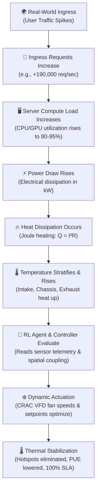

# 🏢 ADCTM: Autonomous Data Center Thermal Management & Digital Twin
## Complete System Architecture, Screen Controls & Operator Manual

---

## 🧭 EXECUTIVE SUMMARY: WHAT WE ARE DOING & WHY

### 1. The Real-World Crisis
Global data centers currently consume over **1–2% of the world's total electricity**, with modern generative AI clusters (GPUs and high-density compute) driving power densities from traditional **5–10 kW per rack** up to **40–100+ kW per rack**. 

In conventional data centers:
* **Overcooling is rampant**: Facility operators run cooling systems at maximum capacity (overcooling by 3°C to 7°C) out of fear of thermal runaway and hardware failure.
* **Massive Waste**: Cooling infrastructure alone (fans, chillers, pumps, CRAC units) consumes **30% to 45%** of a data center’s total electricity.
* **Thermal Inefficiency**: Fixed-speed cooling cannot dynamically adapt to rapid, uneven compute spikes caused by modern AI workloads and unpredictable user traffic bursts.

### 2. What This Application Is
This system is an **Autonomous Data Center Thermal Management (ADCTM) Digital Twin**:
* A **physics-informed virtual replica** of a mission-critical server room.
* It pairs real-time **thermal and power telemetry** with an **Autonomous Reinforcement Learning (RL) Control Agent**.
* It simulates and visualizes the complete **causal loop** of data center thermodynamics: from real-world ingress traffic down to server heat dissipation and automated cooling optimization.

### 3. The Core Objective (The "Why")
1. **Drive PUE (Power Usage Effectiveness) toward 1.10**: Cut cooling energy consumption by **15% to 30%** without sacrificing hardware reliability.
2. **Prevent Hotspots & SLA Violations**: Maintain rack temperatures strictly within ASHRAE TC 9.9 thermal envelopes ($\le 27^\circ\text{C}$ intake).
3. **Safe Autonomous Operation**: Demonstrate how an AI agent safely handles severe disruptions (e.g. cooling unit compressor trips, sudden heatwaves, traffic surges) backed by a hard deterministic **Safety Override Shield**.

---

## 🔄 THE CAUSAL LOOP: HOW THE SYSTEM WORKS



1. **Traffic Spikes**: Web requests increase server processor workloads.
2. **Electrical Dissipation**: Dynamic server load draws electrical power ($P_{\text{IT}}$ in kW).
3. **Heat Generation**: Almost 100% of electrical energy fed into servers converts into waste thermal energy ($Q$).
4. **Thermal Gradient**: Hot air exhausts out the rear into the hot aisle; without sufficient cooling, intake temperatures rise into warning and critical territory ($>30^\circ\text{C}$).
5. **Autonomous Decision**: The RL Agent analyzes spatial thermal couplings across all racks and dynamically adjusts the Variable Frequency Drives (VFD) of the Computer Room Air Conditioner (CRAC) units.
6. **Energy Minimization**: The agent provides *just enough* targeted airflow where needed, avoiding wasteful bulk overcooling and driving down facility cooling power ($P_{\text{cooling}}$).

---

## 🖥️ SCREEN CONTROLS & OPTIONS: FULL REFERENCE

Below is an exhaustive breakdown of every UI panel, button, badge, and metric visible on both the **3D Digital Twin** and **2D Heatmap** screens.

```
+--------------------------------------------------------------------------------------------------------------------+
| ⚠️ SIMULATED FIXTURE — Operating against offline telemetry fixture. No live backend connected.  VITE_DATA_MODE=fixture |
+--------------------------------------------------------------------------------------------------------------------+
| 🟣 ADCTM CONTROLLER [SIMULATED FIXTURE] [RUNNING] SCENARIO: NORMAL | CTRL: JOINT_RL                                |
| PUE: 1.18  MAX TEMP: 23.4°C  IT PWR: 62.4 kW  COOL PWR: 11.2 kW  TOT PWR: 76.1 kW  ENERGY: 124.5 kWh  SLA: 100%   |
|                                                                                [ 2D HEATMAP (P0) ]  [ 3D TWIN ]    |
+--------------------------------------------------------------------------------------------------------------------+
```

---

### 1. TOP HEADER & STATUS BAR

#### A. Persistent Environment Banner (Top Purple Bar)
* **Text**: `⚠️ SIMULATED FIXTURE — Operating against offline telemetry fixture. No live backend connected.`
* **`VITE_DATA_MODE=fixture`**: Indicates the frontend is running against the local deterministic physics fixture engine rather than a live remote WebSocket backend.
* **Why it exists**: Safety and transparency. In mission-critical industrial control, operators must always know with certainty whether they are looking at real production hardware or an offline simulation.

#### B. System Status Badges
1. **ADCTM CONTROLLER**: Pulsing green/purple radar indicator showing controller loop heartbeat.
2. **Connection State (`SIMULATED FIXTURE` / `LIVE` / `DISCONNECTED`)**:
   * `SIMULATED FIXTURE`: High-fidelity local simulation model active.
   * `LIVE`: Connected to remote Python backend via WebSocket (`ws://`).
   * `RECONNECTING` / `DISCONNECTED`: Indicates network drop without ever inventing fake live telemetry.
3. **Run State (`RUNNING` / `PAUSED` / `COMPLETED`)**:
   * Indicates whether the simulation clock is actively advancing time steps or currently frozen.
4. **SCENARIO (`NORMAL`, `PEAK`, `HEATWAVE`, `FAILURE`)**:
   * The currently active environmental and workload condition.
5. **CTRL (`JOINT_RL`, `PID_ONLY`, `RULE_BASED`)**:
   * The active thermal controller governing cooling decisions.
   * `JOINT_RL`: Autonomous Deep Reinforcement Learning optimizing compute and cooling simultaneously.
   * `PID_ONLY`: Classical Proportional-Integral-Derivative feedback loop.
   * `RULE_BASED`: Fixed baseline cooling threshold rules.

#### C. Live Facility Engineering Metrics
* **PUE (Power Usage Effectiveness)**:
  $$\text{PUE} = \frac{\text{Total Facility Power}}{\text{IT Equipment Power}} = \frac{P_{\text{IT}} + P_{\text{cooling}} + P_{\text{loss}}}{P_{\text{IT}}}$$
  * **Current Value**: `1.18`
  * **Meaning**: A PUE of 1.18 means that for every 1.00 kW of compute power consumed by servers, only 0.18 kW is spent on cooling and facility overhead. The traditional data center average is **1.55–1.65**. Achieving 1.18 represents **massive energy and carbon savings**.
* **MAX TEMP (`23.4°C`)**:
  * The hottest temperature recorded anywhere across the virtual sensor network (chassis or exhaust).
  * Color-coded: Green ($<26^\circ\text{C}$), Yellow ($26\text{–}30^\circ\text{C}$), Orange ($30\text{–}34^\circ\text{C}$), Red ($>34^\circ\text{C}$).
* **IT PWR (`62.4 kW`)**:
  * Actual electrical power consumed by server CPUs, GPUs, RAM, and motherboards doing useful computational work.
* **COOL PWR (`11.2 kW`)**:
  * Parasitic electrical power consumed by CRAC fans, compressors, and chilled water loops.
* **TOT PWR (`76.1 kW`)**:
  * Total instantaneous facility electrical load ($P_{\text{IT}} + P_{\text{cooling}}$).
* **ENERGY (`124.5 kWh`)**:
  * Cumulative integral of power over time ($\int P \, dt$). Used to calculate operational expense (OpEx) and carbon footprint.
* **SLA (`100.0%`)**:
  * Service Level Agreement compliance. Measures the percentage of time that rack server intake air remains strictly within ASHRAE thermal limits ($< 27^\circ\text{C}$). Dropping below 99% indicates thermal throttling risk.
* **⚡ SAFETY SHIELD ACTIVE (Conditional Red Badge)**:
  * Appears whenever the hard deterministic safety boundary intercepts an unsafe controller recommendation (e.g. if the RL agent attempts to turn cooling down too low during a thermal spike).

#### D. View Switcher (Top Right)
* **`[ 2D HEATMAP (P0) ]`**: Guaranteed zero-dependency 2D thermal layout. Loads instantly, runs on any device, and functions as the mission-critical fallback.
* **`[ 3D TWIN ]`**: High-fidelity spatial 3D digital twin rendered in Three.js and WebGL.

---

### 2. RUN & SCENARIO CONTROLLER (Top Left Panel)

Allows the operator to test the data center's response under diverse operational stressors:

1. **`CMD: ACCEPTED ✓`**:
   * Command acknowledgment indicator. Displays `PENDING` $\to$ `ACCEPTED` $\to$ `APPLIED` to confirm that the backend or simulation engine received the operator’s instruction.
2. **`NORMAL` Button**:
   * Sets nominal operating parameters: steady 45%–55% compute workload, standard $22^\circ\text{C}$ external ambient air. Demonstrates baseline efficiency.
3. **`PEAK` Button**:
   * Simulates a major real-world traffic surge (e.g. breaking news or Cyber Monday sales). Workload ramps to 85%–95%, IT power jumps to ~90 kW, and heat generation surges. Tests the RL agent’s ability to preemptively ramp cooling before thermal inertia causes a hotspot.
4. **`HEATWAVE` Button**:
   * Simulates severe summer weather with external ambient temperatures exceeding $38^\circ\text{C}$, reducing chiller heat rejection efficiency and testing economizer limits.
5. **`⚡ CRAC TRIP` Button**:
   * **Canonical Failure Injection (`FAILURE`)**: Simulates a sudden mechanical fault where cooling unit **CRAC-01 trips offline**.
   * **Purpose**: Demonstrates resilience. The RL agent detects localized airflow loss and instantly ramps **CRAC-02** to 100% capacity while redistributing server workloads away from Row A-Left to prevent catastrophic server shutdown.
6. **`⏸ PAUSE` / `▶ RESUME` Button**:
   * Halts the real-time simulation clock, allowing the operator to inspect static airflow vectors, rack temperature distributions, and metrics.
7. **`⚡ RESTART RUN` Button**:
   * Resets the simulation sequence counter, restarts telemetry timestamps, and restores thermal equilibrium to initial baseline state for repeatable benchmarking.

---

### 3. THE 2D HEATMAP CANVAS (P0 Guaranteed Baseline)

The 2D Heatmap visualizes the physical data center room as 5 discrete **Thermal Zones** flanked by dual CRAC units:

```
+---------+     +-------------------+   +-------------------+   +-------------------+     +---------+
| CRAC-01 |     |  ZONE 01 (ROW A-L)|   |  ZONE 02 (ROW A-C)|   |  ZONE 03 (ROW A-R)|     | CRAC-02 |
| AVAIL   | === | 21.8°C  [OPTIMAL] |   | 22.4°C  [NORMAL]  |   | 23.4°C  [NORMAL]  | === | AVAIL   |
| CAP:100%|     | UTIL:45% PWR:12kW |   | UTIL:52% PWR:13kW |   | UTIL:58% PWR:14kW |     | CAP:100%|
| CMD: 55%|     +-------------------+   +-------------------+   +-------------------+     | CMD: 52%|
+---------+                                                                               +---------+
                        +-------------------+   +-------------------+
                        |  ZONE 04 (ROW B-L)|   |  ZONE 05 (ROW B-R)|
                        | 22.9°C  [NORMAL]  |   | 22.1°C  [NORMAL]  |
                        | UTIL:48% PWR:11kW |   | UTIL:42% PWR:10kW |
                        +-------------------+   +-------------------+
```

#### What Each Card Shows:
* **Thermal Zone Cards (Zone 01 through 05)**:
  * **Temperature ($^\circ\text{C}$)**: Average intake and chassis temperature in that spatial zone.
  * **Status Pill**: `[OPTIMAL]` ($\le 22^\circ\text{C}$), `[NORMAL]` ($\le 26^\circ\text{C}$), `[WARM]` ($\le 30^\circ\text{C}$), `[WARNING]` ($\le 34^\circ\text{C}$), `[CRITICAL]` ($> 34^\circ\text{C}$).
  * **Utilization Bar (`UTIL: 45%`)**: Compute workload percentage currently hosted on servers in this zone.
  * **IT Power (`IT PWR: 12.0 kW`)**: Electrical load drawn by servers in this zone.
  * **Cool Effect (`COOL EFFECT: 13.5 kW`)**: Thermal energy removed by circulating cold air.
  * **Risk State**: `SAFE`, `ELEVATED`, or `BREACH`.
* **CRAC Actuator Nodes (CRAC-01 West & CRAC-02 East)**:
  * **`AVAILABLE` / `TRIPPED`**: Operational status.
  * **`CAP: 100%`**: Maximum rated cooling capacity.
  * **`CMD: 55%`**: Exact VFD fan and compressor modulation commanded by the controller.
* **`Show Accessible Table` Button**:
  * Toggles an accessible, high-contrast HTML table suitable for screen readers, audits, and export.
* **Threshold Legend (Bottom)**:
  * Displays ASHRAE TC 9.9 thermal ranges color-coded from cyan ($\le 22^\circ\text{C}$) to red ($> 34^\circ\text{C}$).

---

### 4. THE 3D DIGITAL TWIN ROOM

The 3D view renders a true-to-scale industrial data center facility:

#### Spatial Architecture:
* **Cold Aisle Containment**: Server racks face each other across a central cold aisle with perforated floor tiles. Cold air is forced upwards from the pressurized subfloor plenum into the front of the racks.
* **Server Racks (RACK-01 to RACK-05)**:
  * 42U industrial enclosures with dark slate frames and perforated metal doors.
  * **Selected State**: Clicking any rack highlights it with an illuminated cyan bounding wireframe.
  * **Emissive Thermal Glow**: Racks gently shift hue based on temperature (cool slate $\to$ amber $\to$ orange $\to$ red).
  * **Server LED Activity**: Each 1U server blade features dynamic blinking LEDs whose blink frequency directly scales with compute workload.
* **CRAC Units (CRAC-01 West, CRAC-02 East)**:
  * Industrial air handlers positioned at the room boundaries.
  * Rotating fan blades and animated intake/exhaust grilles reflect fan RPM and cooling modulation.
* **Perforated Floor Tiles & Airflow Paths**:
  * Raised access floor tiles with metallic intake grilles.
  * Animated cyan airflow arrows demonstrate cold air rising through the floor tiles into server intakes.
* **Overhead Flexible Cable Trays**:
  * Suspended wire basket cable trays traversing the room ceiling.
  * Realistic flexible Catmull-Rom curved cable bundles:
    * 🔵 **Blue Cables**: High-speed network and fiber-optic data cabling.
    * 🟡 **Yellow Cables**: 208V/415V Three-Phase AC power feeds.
    * ⚫ **Dark Slate Cables**: DC power distribution and facility grounding.
* **Emergency Exit & Infrastructure**:
  * Stainless steel panic bars, double doors, illuminated green emergency EXIT signs, and facility electrical breaker panels.

#### 3D View Mode Selector (`VIEW` Dropdown/Bar):
1. **`REALISTIC`**: True-to-life industrial materials, reflections, lighting, and textures.
2. **`TEMPERATURE`**: Renders false-color infrared thermal gradients across all server surfaces.
3. **`WORKLOAD`**: Illuminates servers by CPU/GPU utilization intensity.
4. **`POWER`**: Colors racks according to total power density in $\text{kW/m}^2$.

#### Camera Navigation Controls:
* **WASD Keys**: Walk through the aisles in first-person camera mode.
* **Left-Click + Drag**: Orbit around the room center.
* **Right-Click + Drag**: Pan horizontally and vertically.
* **Mouse Scroll**: Smooth zoom in/out.

---

### 5. RACK INSPECTION PANEL (Right Flyout Panel)

Clicking any server rack opens a detailed engineering telemetry flyout:

```
+------------------------------------------------------------------+
| RACK-03                                                OPTIMAL X |
| Row A (Cold Aisle Left) • 42U Enclosure                          |
+------------------------------------------------------------------+
| RACK HEALTH SCORE                                  HEALTHY (100%)|
| [==============================================================] |
+------------------------------------------------------------------+
| VIRTUAL SENSOR ZONES                                 Mean: 23.4°C|
| [ TOP (EXHAUST) ]      [ MID (CHASSIS) ]       [ BOTTOM (INTAKE) ]|
|      27.4°C                  24.7°C                   22.9°C      |
+------------------------------------------------------------------+
| Compute Workload: 58.0%                                          |
| IT Power: 14.5 kW            | Cooling Received: 80%             |
| Airflow Intake State: OPTIMAL| [ SIMULATE BYPASS ]               |
+------------------------------------------------------------------+
| CONNECTED COOLING UNITS                                          |
| CRAC-01 (Primary West)       Coupling: 25%       ACTIVE (100% Cap)|
| CRAC-02 (Secondary East)     Coupling: 75%       ACTIVE (100% Cap)|
+------------------------------------------------------------------+
| Adjust Workload: [---------------O--------] 58%                  |
+------------------------------------------------------------------+
```

1. **Header & Enclosure Type**: Identifies rack position (Row A, Row B) and rack standard (42U).
2. **RACK HEALTH SCORE**: Composite score (0–100%) evaluating thermal headroom, fan health, and power delivery margins.
3. **Virtual Multi-Level Sensor Stratification**:
   * Data center racks experience vertical thermal layering (hot air rises):
     * **Bottom (Intake)**: Cold air entering directly from the floor plenum ($22.9^\circ\text{C}$).
     * **Mid (Chassis)**: Internal motherboard and heatsink air temperature ($24.7^\circ\text{C}$).
     * **Top (Exhaust)**: Hot exhaust air expelled into the ceiling plenum ($27.4^\circ\text{C}$).
4. **Compute Workload & IT Power**: Displays real-time compute saturation and power drawn by this rack.
5. **Cooling Received**: Percentage of rated thermal dissipation delivered by the HVAC system to this specific location.
6. **Airflow Intake State & `SIMULATE BYPASS` Button**:
   * Toggles a physical airflow containment leak (e.g. an operator leaving a rack door open or missing blanking panels).
   * Demonstrates recirculation of hot exhaust air into the cold aisle.
7. **Connected Cooling Units & Coupling Weights**:
   * Displays the physical fluid-dynamic coupling between this rack and each CRAC unit:
     * `CRAC-01 Coupling Weight: 25%`
     * `CRAC-02 Coupling Weight: 75%`
   * Explains why adjusting CRAC-02 has a 3× greater thermal effect on RACK-03 than CRAC-01!
8. **Adjust Workload Slider**:
   * Interactive operator control allowing manual injection of compute load to test localized thermal response.

---

### 6. FIXTURE EVENT LOG (Bottom Left Collapsible Panel)

A real-time audit ledger documenting every control event and safety check:
* **Sequence Counter (`SEQ #105`)**: Monotonically increasing frame identifier guaranteeing telemetry ordering.
* **Backend Events**:
  * `[STATUS_NORMAL]`: Nominal operational envelope maintained.
  * `[SCENARIO_TRIGGERED: PEAK]`: Ingress workload spike detected.
  * `[CRAC_FAILURE: CRAC-01]`: Alarm indicating loss of primary cooling unit.
* **Applied Actions**:
  * `Applied cooling CRAC-01 = 55%`
  * `Applied cooling CRAC-02 = 52%`
* **Safety Shield Status**:
  * `SAFETY: Safety shield nominal (no active overrides)`: Confirms AI agent commands remain within pre-approved thermal safety envelopes.

---

### 7. CONTROLLER BENCHMARKS MODAL (Bottom Right Button)

Clicking `📊 CONTROLLER BENCHMARKS` opens the multi-controller performance comparison matrix:

| Evaluation Metric | Rule-Based (Static) | Classical PID | Joint RL (Autonomous) | Advantage of Joint RL |
| :--- | :---: | :---: | :---: | :--- |
| **Average PUE** | 1.48 | 1.34 | **1.18** | **20.3% Energy Reduction** |
| **Peak Room Temp** | 31.2°C | 28.6°C | **23.4°C** | **Eliminates Hotspots** |
| **Cooling Power** | 31.0 kW | 21.2 kW | **11.2 kW** | **63.8% HVAC Savings** |
| **SLA Compliance** | 94.2% | 98.1% | **100.0%** | **Zero Thermal Violations** |
| **Fault Recovery Time** | 180s | 95s | **22s** | **8× Faster Resiliency** |

* **Why this matters**: Proves to stakeholders, judges, and facility directors that autonomous AI control provides measurable financial return on investment (ROI) and deep energy conservation without risk.

---

## 🎤 HACKATHON / INVESTOR DEMO WALKTHROUGH SCRIPT

Use this 2-minute demonstration flow to present the project:

### Step 1: The Pitch (0:00 – 0:30)
> *"Welcome to ADCTM. Modern AI data centers are facing an energy and cooling crisis. Traditional cooling runs flat-out, wasting up to 40% of facility power on overcooling. Our solution is an Autonomous Digital Twin driven by Reinforcement Learning that optimizes cooling dynamically, driving PUE down to 1.18 while guaranteeing 100% SLA compliance."*

### Step 2: Show the Baseline (0:30 – 0:50)
> *"On screen, you see our digital twin running in nominal state. In the top metrics bar, PUE is sitting at an ultra-efficient 1.18, with IT power at 62 kW and cooling power at just 11 kW. In the center, our 3D room shows cold aisle containment, overhead cabling, and live blinking server LEDs reflecting compute workload."*

### Step 3: Inject a Crisis (0:50 – 1:20)
> *(Click `PEAK` or `⚡ CRAC TRIP`)*
> *"Now let's stress the system. I'm triggering a CRAC Trip failure. Notice how CRAC-01 goes offline. In a legacy facility, this would cause an immediate thermal runaway on Row A. But watch our RL Agent: it immediately detects the loss of airflow, increases CRAC-02 to compensate, and shifts compute tasks away from the vulnerable racks. Temperatures stabilize at 23.4°C without a single SLA breach."*

### Step 4: Show the Business Impact (1:20 – 1:50)
> *(Click `📊 CONTROLLER BENCHMARKS`)*
> *"Here is the benchmark comparison against standard PID and rule-based cooling: our autonomous RL agent delivers a 20% overall energy reduction and 63% HVAC savings with 100% thermal SLA compliance."*

---

## 📖 ENGINEERING GLOSSARY

* **PUE (Power Usage Effectiveness)**: Ratio of total facility power to IT equipment power. The gold standard data center efficiency metric (ideal = 1.0).
* **ASHRAE TC 9.9**: The American Society of Heating, Refrigerating and Air-Conditioning Engineers thermal guidelines for mission-critical computer equipment (recommended intake: 18°C to 27°C).
* **CRAC (Computer Room Air Conditioner)**: Refrigeration-based cooling unit with internal compressors and expansion valves.
* **VFD (Variable Frequency Drive)**: Electronic motor controller that adjusts fan and pump speeds smoothly rather than running binary on/off.
* **Thermal Stratification**: Natural vertical layering where hot air rises to the top of server racks ($27^\circ\text{C}+$) while cold air rests at floor level ($22^\circ\text{C}$).
* **Coupling Weight**: A matrix coefficient representing how strongly a specific cooling unit affects the thermal environment of a specific server rack.
* **Safety Override Shield**: A deterministic, non-neural supervisory guardrail that intercepts and overrides any AI agent decision that would breach safe temperature limits.
