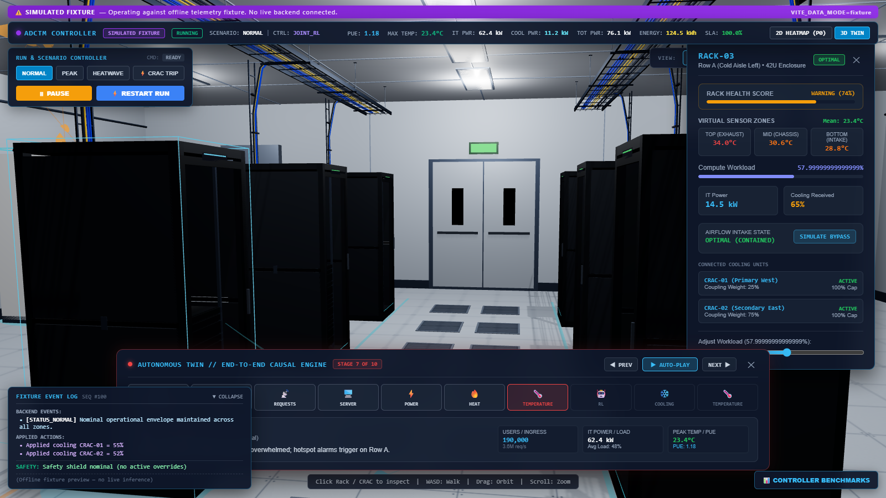
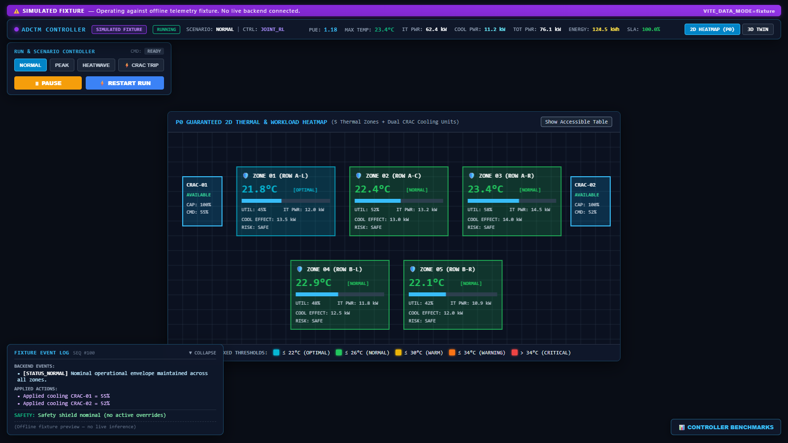

# 🏢 ADCTM: Autonomous Data Center Thermal Management
### 3D Digital Twin & Guaranteed P0 2D Heatmap Frontend

An enterprise-grade **Autonomous Data Center Thermal Management (ADCTM) Digital Twin** designed to monitor, simulate, and autonomously optimize data center cooling and compute workloads in real time.

---

## 📸 Screenshots

| 3D Digital Twin (Three.js / WebGL) | Guaranteed P0 2D Thermal Heatmap |
| :---: | :---: |
|  |  |

---

## 🚀 Quick Start for Teammates

### 1. Clone & Install
`ash
git clone https://github.com/SHREYANSHJAIN03/frontend.git
cd frontend
npm install
`

### 2. Run Locally
`ash
npm run dev
`
The application will launch on **http://127.0.0.1:5173/**.

By default, the application runs in **Offline Fixture Mode**, allowing complete frontend development, 3D interaction, and testing without requiring a running backend.

---

## 🔌 Backend Integration Guide

To connect the frontend to your live Python / FastAPI / RL backend:

### 1. Update Environment Variables
Create or edit .env in the project root:
`env
# Switch from 'fixture' to 'live'
VITE_DATA_MODE=live

# Point to your backend server host and port
VITE_API_BASE_URL=http://localhost:8000
VITE_WS_URL=ws://localhost:8000/ws/telemetry

# Enable 3D spatial twin view
VITE_ENABLE_3D=true
`

### 2. Expected Backend REST & WebSocket Endpoints

| Method | Path | Description | Expected Payload |
| :---: | :--- | :--- | :--- |
| **WS** | /ws/telemetry | Continuous live telemetry push stream (1–5 Hz) | Canonical 	elemetry.frame JSON |
| **GET** | /api/v1/config | Facility room layout and dynamic ASHRAE temperature thresholds | { facility_id, temperature_thresholds, topology } |
| **GET** | /api/v1/runs/current | Authoritative initial state snapshot on connect/reconnect | Initial 	elemetry.frame JSON |
| **POST** | /api/v1/runs | Start a new simulation/experiment run | { "scenario": "NORMAL", "controller": "JOINT_RL" } |
| **POST** | /api/v1/runs/{id}/commands | Operator commands from UI controls | { "action": "PAUSE" \| "RESUME" \| "SET_SCENARIO", "scenario": "PEAK" } |
| **POST** | /api/v1/benchmarks | Trigger multi-controller benchmark run | { "scenarios": [...], "seeds": 5, "duration_s": 3600 } |
| **GET** | /api/v1/benchmarks/{id} | Poll benchmark progress | { "benchmark_id": "...", "status": "RUNNING" \| "COMPLETED" } |
| **GET** | /api/v1/benchmarks/{id}/results | Final multi-controller evaluation metrics | Array of { controller, mean_pue, max_temp_c, sla_uptime_percent, energy_used_kwh } |

### 3. Telemetry Frame Schema (	elemetry.frame)
`json
{
  "type": "telemetry.frame",
  "schema_version": "1.0.0",
  "run_id": "run-001",
  "sequence": 105,
  "timestamp": "2026-09-05T09:40:00Z",
  "simulation_time_s": 620,
  "run_state": "RUNNING",
  "scenario": "NORMAL",
  "controller": "JOINT_RL",
  "metrics": {
    "pue": 1.18,
    "it_power_kw": 62.4,
    "cooling_power_kw": 11.2,
    "total_power_kw": 76.1,
    "energy_used_kwh": 124.5,
    "max_temperature_c": 23.4,
    "sla_percent": 100.0,
    "sla_violations": 0,
    "shed_demand_kw": 0.0
  },
  "zones": [
    { "id": "zone-01", "temperature_c": 21.8, "utilization": 0.45, "it_power_kw": 12.0, "cooling_effect_kw": 13.5, "risk": "SAFE" },
    { "id": "zone-02", "temperature_c": 22.4, "utilization": 0.52, "it_power_kw": 13.2, "cooling_effect_kw": 13.0, "risk": "SAFE" },
    { "id": "zone-03", "temperature_c": 23.4, "utilization": 0.58, "it_power_kw": 14.5, "cooling_effect_kw": 14.0, "risk": "SAFE" }
  ],
  "cooling_units": [
    { "id": "crac-01", "command": 0.55, "available_capacity": 1.0, "status": "AVAILABLE" },
    { "id": "crac-02", "command": 0.52, "available_capacity": 1.0, "status": "AVAILABLE" }
  ],
  "actions": {
    "proposed_cooling": [0.55, 0.52],
    "applied_cooling": [0.55, 0.52],
    "workload_moves": []
  },
  "safety": {
    "override_active": false,
    "reasons": []
  },
  "events": [
    { "code": "STATUS_NORMAL", "severity": "INFO", "message": "Nominal operational envelope maintained." }
  ]
}
`

---

## 🛠️ Verification & Scripts

`ash
# Run unit & contract validation test suite
npm test

# Run Oxlint linter
npm run lint

# Compile production build (confirms code-splitting of 3D bundle)
npm run build
`

---

## 📖 Complete Documentation
For full details on the thermodynamics causal chain, screen controls, metrics, and hackathon presentation pitch, refer to:
📄 [**OPERATOR_GUIDE_AND_SYSTEM_MANUAL.md**](OPERATOR_GUIDE_AND_SYSTEM_MANUAL.md)
